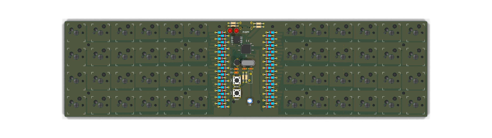
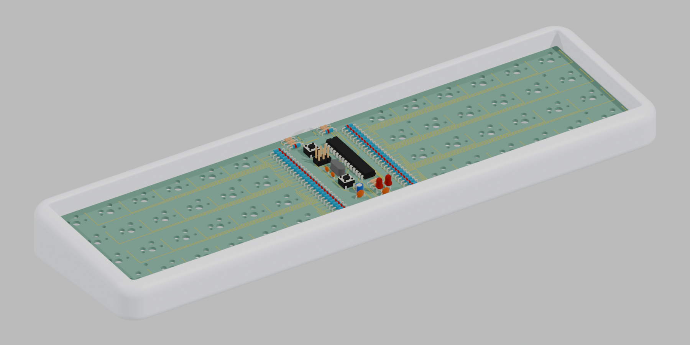
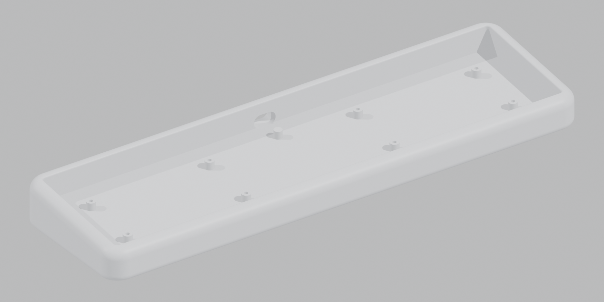
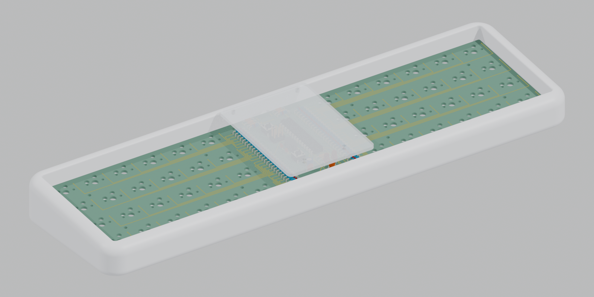

# eugeo

6 キー × 4 行 × 2 ブロック（48 キー）のスルーホール・オーソリニア 40% キーボード PCB です。
[Lumberjack](https://github.com/peej/lumberjack-keyboard)（Paul James 作、MIT License）をベースに、行を 1 段減らし、Kailh の MX 用ホットスワップソケットに対応させました。





## Lumberjack からの変更点

| | Lumberjack Rev 1.8 | eugeo Rev 1.0 |
|---|---|---|
| 配列 | 5 × 12（60 キー） | 4 × 12（6 × 4 × 2、48 キー） |
| スイッチ | はんだ付け | Kailh MX ホットスワップソケット（裏面） |
| マトリクス | 6 行 × 10 列 | 8 行 × 6 列（後述） |
| USB-C | 左上・裏面 | 中央上・裏面（ソケットとの干渉回避） |
| 外形 | 60% トレイマウントケース互換 | 284.9 × 75.35 mm、M2 穴 8 箇所でサンドイッチ |
| ドーターボード用コネクタ (J3-J5) | あり | 削除 |
| 中央カバー | 2 mm アクリル、M2 10 mm スペーサー 4 本 | 同じ構成（穴位置はダイオード配置に合わせて変更） |

マイコン（ATmega328P-PU + V-USB）、水晶、USB 保護回路、RESET / BOOT ボタン、ISP ヘッダの回路は Lumberjack と同じです。
中央にダイオードと MCU を並べる見た目も踏襲しています。

## マトリクス

左右のブロックで行を分け、列を共有させた 8 行 × 6 列です。
左右の対称位置の列（左 C0 と右 C11 など）を基板下端の 1 本の配線で共有するので、ROW の配線が MCU をまたがずに済みます。
使う I/O は 14 本です（PC0 / PC2 は空き）。

| 物理位置 | マトリクス |
|---|---|
| 左ブロック (row r, col c) | ROW r, COL c |
| 右ブロック (row r, col 6+j) | ROW r+4, COL 5-j |

| 設定 | 値 |
|---|---|
| MATRIX_ROW_PINS | D0, D1, D4, D5, C5, C1, B5, B1 |
| MATRIX_COL_PINS | B4, B3, B2, B0, D7, D6 |
| DIODE_DIRECTION | COL2ROW |
| LED1 (赤) / LED2 (緑) | C4 / C3 |
| USB D+ / D- | D2 / D3 |
| BOOT ボタン | D5（ROW3 と共用） |

BOOT ボタンは ROW3（PD5）と同じピンにつながっています。通常使用中に BOOT だけを押してもキー入力は出ませんが、BOOT を押したまま左ブロック最下段のキーを押すと、同じ列のほかのキーも押されたと誤検出されます。

## ファイル構成

| パス | 内容 |
|---|---|
| `eugeo.kicad_pro` / `.kicad_sch` / `.kicad_pcb` | KiCad 9 プロジェクト |
| `symbols/`, `footprints/eugeo.pretty/` | プロジェクト専用シンボル・フットプリント（ホットスワップソケット、USB-C、M2 穴） |
| `plates/` | スイッチプレート（左右共通、2 枚注文）、中央カバー、ボトムプレートの KiCad データと DXF |
| `case/` | Mojo60 風の丸いトレイケースと中央カバーの STEP / STL |
| `foam/` | プレートフォームとケースフォームの DXF と原寸 PDF |
| `lasercut/yushakobo/` | 遊舎工房レーザー加工サービス用の SVG（中央カバー / スイッチプレート / フォーム） |
| `jlcpcb/` | ホットスワップソケットの JLCPCB 実装用 BOM / CPL |
| `gerbers/*.zip` | 製造用ガーバー（PCB、プレート、ボトム） |
| `firmware/qmk/keyboards/eugeo/` | QMK 用キーボード定義とデフォルトキーマップ |
| `scripts/` | 回路図・基板を生成するスクリプト一式 |

## 生成手順

回路図と基板は `scripts/design.py` を唯一の定義として生成しています。
部品配置やネットを変えるときは `design.py` を編集して再生成してください。

```bash
FREEROUTING_JAR=/path/to/freerouting-2.1.0.jar scripts/build_all.sh
```

1. `gen_schematic.py` で回路図を生成し、`check_netlist.py` で `design.py` とネットを照合
2. `build_pcb.py` で部品配置と、キー部分・ダイオード列・USB 端子まわりの配線を規則的に引く
3. `route.sh` で残り（MCU 周り）を Freerouting 2.1.0 で自動配線
4. `cleanup_dangling.py` で余った配線を削除し、`fill_zones.py` で裏面 GND ベタを流す
5. DRC（回路図との整合チェック込み）

Freerouting の結果は実行ごとに変わり、まれに未配線が残ります。その場合は `build_all.sh` を再実行してください。
Freerouting 2.1.0 は Java 21 で動きます（2.2 以降は Java 25 が必要）。
初回起動時にできる設定ファイル（macOS では `$TMPDIR/freerouting/freerouting.json`）はテレメトリが有効なので、`allow_telemetry` を `false` にしておくことを勧めます。

製造データは次のコマンドで出力します。

```bash
scripts/export_fab.sh
```

## 製造（JLCPCB）

2026-10-06 に JLCPCB / JLC3DP の見積もりページへアップロードし、次のとおり受け付けられることを確認しました（カート投入・注文はしていません）。

| 部品 | ファイル | JLCPCB の認識 | 見積もり（参考） |
|---|---|---|---|
| PCB | `gerbers/eugeo.zip` | 2 層、284.9 × 75.35 mm | 5 枚 ¥2,269 + 送料 ¥1,536 |
| スイッチプレート | `gerbers/eugeo-plate.zip` | 2 層、113.45 × 75.35 mm。外形レイヤーにスイッチ穴 24 個と M2 穴 4 個 | 5 枚 ¥630 |
| ケース | `case/eugeo-case.step` | 302.9 × 93.4 × 29.9 mm、198.09 cm³ | 9600 Resin 白 1 個 ¥2,978 + 送料 ¥1,139 |

PCB の注文設定は既定値（FR-4、1.6 mm、HASL）のままで問題ありません。色は好みで変えてください。
スイッチプレートは銅箔のない基板として注文します。JLCPCB の 2D プレビューでは穴が描かれませんが、Gerber Viewer の Layers 表示で外形に穴が入っていることを確認できます。左右共通なので 2 枚以上あれば足ります。
ボトムプレート（`gerbers/eugeo-bottom.zip`）はケースを使わない場合だけ必要です。

ケースは JLC3DP の 3D Printing で `case/eugeo-case.step`（または `.stl`）をアップロードし、素材に SLA レジン（9600 Resin など）を選びます。
最大造形サイズ（9600 Resin は 780 × 780 × 530 mm）には十分収まります。

### ソケットの実装を JLCPCB に頼む場合

ホットスワップソケット 48 個だけを JLCPCB の PCBA で実装し、残りのスルーホール部品は自分ではんだ付けする想定です。
PCB の見積もりページで「PCB Assembly」をオンにし、Assembly Side を **Bottom Side** にして、次のファイルをアップロードします。

| ファイル | 内容 |
|---|---|
| `jlcpcb/eugeo-bom.csv` | MX1〜MX48 を CPG151101S11 互換ソケット（LCSC C41430893）として指定 |
| `jlcpcb/eugeo-cpl.csv` | 各ソケット本体の中心座標（ガーバーと同じ原点）、実装面 Bottom、回転 0 |

2026-10-06 に実際にアップロードして確認した結果です（カート投入・注文はしていません）。

- Economic PCBA でも裏面実装を選べ、C41430893（在庫約 26 万個）で実装できる
- 部品配置プレビュー（裏面）で、ソケットの突起が基板の φ3.05 穴に、端子がパッドに重なることを確認。回転角の補正は不要
- 見積もり: PCB 5 枚 + ソケット実装 5 枚分で ¥5,955（PCB ¥2,269、PCBA ¥3,686。送料別）

Kailh 純正品（C5184526）は Standard PCBA 専用で、確認時点では在庫が 241 個と足りませんでした。純正にしたい場合は `scripts/export_jlc_pcba.py` の `LCSC` を書き換え、Standard PCBA で配置プレビューを確認してから注文してください。

## ケース

Mojo60 を意識した、角と上下のふちを大きく丸めた一体型のトレイケースです。



| 項目 | 値 |
|---|---|
| 外形 | 302.9 × 93.4 mm、高さ 手前 20.6 mm / 奥 30.4 mm |
| 傾斜 | 6° |
| 角の丸み | 平面 R12、上面のふち R6.5、底面のふち R4.5 |
| ふち | プレート上面から 4 mm 上（スイッチの筐体がほぼ隠れる高さ） |
| 基板と壁のすき間 | 1.0 mm（キーキャップと壁の間は約 1.1 mm） |
| 底面 | 肉抜きして、幅 6 mm のふちで接地 |
| 刻印 | 奥の壁に「EUGEO」の銘板（後述） |

### 刻印

奥の壁の USB-C の横（背面から見て右）に、銘板風の刻印を入れています。
USB-C の切り欠きと同じ高さ 8.5 mm の長円を 0.6 mm 掘り下げ、Futura の「EUGEO」（文字高さ約 4.4 mm、字間広め）と両端の小さな鋲を元の壁面の高さで残しています。
USB-C の切り欠きと形・高さを揃えて、背面の 2 つの要素が並んで見えるようにしました。


文字・フォント・位置・深さは `scripts/case.py` の `BADGE_*` 定数で変えられます。

寸法は `scripts/case.py` の先頭にある定数で変えられます。再生成の手順は次のとおりです。

```bash
uv venv --python 3.12 .venv && uv pip install --python .venv/bin/python build123d
.venv/bin/python scripts/case.py
kicad-cli pcb export step --subst-models -o /tmp/eugeo-pcb.step eugeo.kicad_pcb
.venv/bin/python scripts/check_case_fit.py /tmp/eugeo-pcb.step   # 基板・部品・プレートとの干渉チェック
```

### 組み立て

レジンには熱圧入インサートが使えないため、ネジはケースの底から通します。

1. 基板の上面から M2 3.5 mm のメス-メススペーサーを当て、ケースの底から M2×10 のなべネジで、ケースの支柱と基板を挟んで締める
2. スイッチをプレートにはめ、基板のソケットに差し込む
3. 必要ならプレートの上から M2×3 でスペーサーに留める（スイッチとソケットだけでも固定される）

奥の壁の USB-C 用の切り欠きは 14 × 8.5 mm です。プラグのモールド部分がこれより大きいケーブルは奥まで刺さりません。
底面のふちに小さいゴム足を貼ってください。

## 中央カバー

Lumberjack と同じく、中央の部品（ダイオード列・MCU・USB 周り）を透明な板で覆えます。



| 項目 | 値 |
|---|---|
| 大きさ | 56.2 × 75.35 mm、角 R3、厚さ 2 mm |
| 取り付け | 基板中央の M2 穴 4 か所（H9〜H12）に M2 10 mm のメス-メススペーサーを立て、下から M2×4 で基板に、上から M2×4 でカバーを留める |
| 高さ | カバーの下面は基板上面から 10 mm。下でいちばん高い ISP ピンヘッダ（8.54 mm）との間に 1.46 mm のすき間 |
| ケースとの関係 | カバーの上面はケースのふちより約 3 mm 上。ケース・キーキャップとは重ならない |

| ファイル | 用途 |
|---|---|
| `plates/eugeo-cover.dxf` | アクリル板のレーザーカット用（推奨） |
| `case/eugeo-cover.step` / `.stl` | 3D プリントや CNC 用 |
| `gerbers/eugeo-cover.zip` | JLCPCB で FR4 板として作る場合（不透明になる） |

JLCPCB の基板サービスでは透明な板は作れないため、透明にしたい場合はアクリルのレーザーカットサービスに DXF を出してください。
JLC3DP の SLA で作る場合は、見積もり画面で透明系のレジンが選べるか確認してください。

## フォーム

打鍵音とたわみの調整用に、2 種類のフォームの型を用意しました。どちらも左右同じ形なので、1 つの型で 2 枚切り、片方は裏返して使います。

| ファイル | 位置 | 推奨素材 | 形 |
|---|---|---|---|
| `foam/eugeo-plate-foam` | プレートと PCB の間（3.5 mm） | 3 mm PORON | プレートと同じ外形、スイッチ下部を逃がす 14.5 mm 角穴、スペーサー用 φ4.4 穴 |
| `foam/eugeo-case-foam` | PCB とケース底の間（5 mm） | 3 mm PORON | キー部分のみ（中央の部品エリアは空ける）、ケースの支柱用 φ7 穴 |

`.dxf` はレーザーカット業者向け、`-1to1.pdf` は手で切るための原寸の型紙です。PDF は A4 横で、倍率 100% で印刷し、100 mm のスケールバーで寸法を確かめてから使ってください。
ケースフォームは 3 mm にすると、裏面のソケット（高さ約 1.85 mm）との間にほぼすき間がない厚さになります。
JLCPCB ではフォームのカットは扱っていないため、遊舎工房のレーザー加工（下記）に出すか手で切ってください。
スイッチプレート（`gerbers/eugeo-plate.zip`）は、ケースの内側に 1 mm のすき間で収まり、ケースのふちより 4 mm 低い位置に来ることを確認済みです。

## 遊舎工房のレーザー加工

[遊舎工房のレーザー加工サービス](https://yushakobo.jp/lasercut/)に、そのまま入稿できる SVG を `lasercut/yushakobo/` に用意しました。
遊舎工房配布の Inkscape テンプレートを土台にし、注文サイズの作業領域だけを残しています。

| ファイル | 注文するサービス / 素材 / 厚さ / サイズ | 中身 |
|---|---|---|
| `eugeo-cover_acrylic-clear-2mm_115x300.svg` | [レーザー加工サービス](https://shop.yushakobo.jp/products/lasercut)（アクリル）/ アクリル クリア / 2mm / 115x300 | 中央カバー 1 枚 |
| `eugeo-switch-plate_pom-1.5mm_245x245.svg` | [レーザー加工サービス（その2）](https://shop.yushakobo.jp/products/lasercut-2) / POM / 1.5mm / 245x245 | スイッチプレート 2 枚（左右共通） |
| `eugeo-foam_poron-3mm_500x100.svg` | レーザー加工サービス（その2）/ PORON / 3mm / 500x100 | プレートフォーム 2 枚 + ケースフォーム 2 枚 |

- 穴などの内側はカット①（赤）、外形はカット②（青）です。内側を先に切ってから部品を切り離す順番になります
- 線幅 0.001 mm、塗りなし、RGB、ファイル名は半角英数字です。シート端から 8 mm、部品同士は 5 mm 空けています（規定は 3 mm / 2 mm 以上）
- レーザーは線の上を切るため、穴は線より少し大きく、外形は少し小さく仕上がります。POM プレートのスイッチ穴（14.0 mm）が緩い場合は、注文時に相談してください
- スイッチプレートは JLCPCB の FR4（`gerbers/eugeo-plate.zip`）と POM のどちらで作っても同じ形です。POM のほうが打鍵感が柔らかくなります

テンプレートはリポジトリに含めていません。作り直すときは、遊舎工房の [Laser_Cut_template](https://drive.google.com/drive/folders/1BYeC-_gsrWUxI49BNqbQBk6OOC30LgTS) の Inkscape フォルダにある `Laser_acrylic_template.svg`、`Laser_POM_template.svg`、`Laser_Poron_template.svg` を 1 つのフォルダに置き（POM / Poron はファイル名を小文字の `pom` / `poron` にする）、次を実行します。

```bash
python3 scripts/export_yushakobo_svg.py <テンプレートのフォルダ>
python3 scripts/check_lasercut_svg.py
```

## 組み立て（基板）

- ホットスワップソケットと USB-C は裏面、それ以外の部品は表面に付けます
- ダイオードは帯（カソード）を MCU 側に向けます。左列はシルクの右側、右列は左側がカソードです
- プレートと PCB の間は 3.5 mm（1.5 mm 厚プレートでスイッチ底面が PCB に接する高さ）です
- ケースを使わずボトムプレートで挟む場合は、裏面の USB-C とソケットを避けるため PCB とボトムの間を 8 mm 程度空けます

## ファームウェア

`firmware/qmk/keyboards/eugeo` を qmk_firmware の `keyboards/` にコピーしてビルドします。
2026-10-06 時点の qmk_firmware でビルドできることを確認済みです（14,294 / 28,672 バイト）。ビルド済みの `firmware/eugeo_default.hex` も置いてあります。

```bash
qmk compile -kb eugeo -km default
```

ブートローダーは Lumberjack と同じ USBaspLoader（16 MHz、D+ = PD2、D- = PD3、BOOT = PD5）を使えます。
BOOT を押しながら RESET を押して離すと書き込みモードに入ります。
ブートローダーが入っていない ATmega328P には、Lumberjack の[ビルドガイド](https://github.com/peej/lumberjack-keyboard/blob/master/guide.md#bootloader)の手順で ISP から書き込んでください。

### Remap / VIA

`via` キーマップは VIA 対応（`VIA_ENABLE = yes`）で、[Remap](https://remap-keys.app) と VIA のどちらからでもキー配置を変えられます。
ビルド済みの `firmware/eugeo_via.hex` もあります（14,532 / 28,672 バイト、RAM 388 / 2,048 バイト）。

```bash
qmk compile -kb eugeo -km via
```

1. BOOT を押しながら RESET を押して離し、書き込みモードにする（USBasp として認識される）
2. `qmk flash -kb eugeo -km via`、または QMK Toolbox / avrdude（`-c usbasp -p m328p`）で `eugeo_via.hex` を書き込む
3. Chrome か Edge で Remap を開き、「Configure」から eugeo を接続する
4. Remap のカタログに未登録のうちは定義ファイルを求められるので、`firmware/via/eugeo.json` を読み込む

`firmware/via/eugeo.json` は VIA v3 形式の定義ファイルで、物理配列どおり左右ブロックの間を 3U 空けています。VIA の Design タブでもそのまま読み込めます。
Remap の書き込み機能は USBaspLoader に対応していないため、書き込みは上記の手順で行ってください。

Remap のカタログに登録すれば、定義ファイルを読み込まなくても自動で認識されます。登録は Remap に GitHub アカウントでログインして申請し、ファームウェアのソースの場所（GitHub のリポジトリなど）を示します。
VID / PID（`0x6B6E` / `0x4547`）は自分で決めた値です。登録前に、他のキーボードと重複していないか Remap 上で確認してください。

## 動作の検証

実機は作っていないため、基板データからの検証で、はんだ付けすれば動くことを確認しています。

- KiCad の DRC: 違反 0、未接続 0、回路図との整合 OK。ERC も 0 件
- `scripts/verify_design.py`（49 項目すべて合格）
  - ATmega328P のピン名がデータシートと一致し、電源・GND・水晶・リセットの接続が正しいこと
  - USB: D+ が PD2（INT0）、D- が PD3、D- の 1.5k プルアップ、ツェナー、CC の 5.1k、VBUS のポリスイッチ
  - ISP ヘッダの接続がシルク表記（RST SCK MISO / GND MOSI VCC）と一致すること
  - LED とコンデンサの極性、ダイオードの向き（COL2ROW）
  - 48 キーすべてについて、基板上の行・列のピンが QMK の `keyboard.json` と一致すること
  - BOOT ボタンが Lumberjack のブートローダーと同じ PD5 にあること
- Lumberjack の回路との差分: USB・電源・水晶・リセット・ISP の周辺回路は同一。違いは LED とマトリクス用のピン割り当てだけで、どちらも意図したもの
- 中央カバー: 下面と部品の最小すき間 1.46 mm（ISP ピンヘッダ）、カバーとケース・部品の干渉 0（`scripts/check_case_fit.py`）
- ソケットのフットプリント: パッド位置・サイズが [keyswitch-kicad-library](https://github.com/perigoso/keyswitch-kicad-library) の SW_Hotswap_Kailh_MX_1.00u と一致。ソケットの突起が入る穴は同ライブラリに合わせて φ3.05 mm

```bash
KP=/Applications/KiCad/KiCad.app/Contents/Frameworks/Python.framework/Versions/Current/bin/python3
$KP scripts/verify_design.py
```

### 発注前チェック

発注の前に `scripts/preorder_check.py` を実行してください（2026-10-07 時点で 22 項目すべて合格）。DRC で見えない次の点を確かめます。

- 前の版との差分が、意図した部品の追加・削除だけであること（ほかのパッドの位置と接続が変わっていない）
- 全部品が `design.py` どおりの位置・向き・面にあり、外形も設計どおりであること
- スペーサー・ネジ頭・ケースの支柱が当たる範囲に、むき出しの銅箔がないこと。ビアがすべてレジストで覆われていること（マスクのガーバーでも確認）
- 実際の基板の最小値（線幅 0.25、ビア φ0.3 / 0.6、穴、スロット、シルク文字 1.0 mm）が JLCPCB の製造基準を満たすこと
- `gerbers/eugeo.zip` が今の基板から出したものと一致し、ドリルデータに M2 穴 12 個が設計位置どおりにあること
- JLCPCB の実装座標、スイッチプレート・中央カバー・ボトムプレートの穴が基板の穴と一致すること
- 遊舎工房向け SVG が入稿ルールを満たすこと、49 項目の機能チェックが通ること

```bash
$KP scripts/preorder_check.py --base <前回発注した版の git リビジョン>
```

## 未検証の点

- 試作していません。上記の検証、ケースとの干渉チェックは通っています
- USB-C コネクタ（TYPE-C-31-M-12）は 0.5 mm ピッチの SMD で、手はんだでは一番難しい部品です（Lumberjack と同じ部品）
- ケースの USB-C 部はコネクタの 3D モデルがないため、寸法計算だけで確認しています
- ホットスワップソケットのフットプリントは keyswitch-kicad-library と同寸で、JLCPCB の部品配置とも一致しましたが、実物のソケットでの勘合は未確認です

## License

ハードウェア（回路図・基板・プレート・ケース・フォーム）とスクリプトは MIT License です。Lumberjack の著作権表示を `LICENSE` に残しています。
`firmware/qmk/` 以下のファームウェアは QMK に合わせて GPL-2.0-or-later です。
